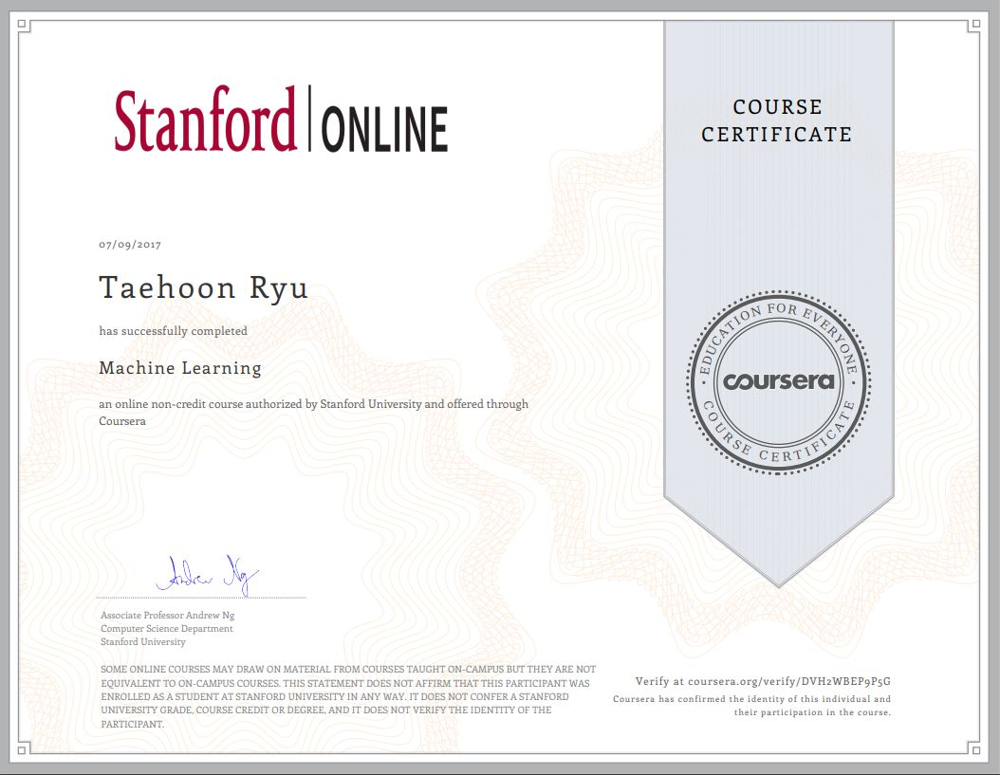

# Machine Learning on Coursera
Coursera learning-related project about Machine Learning.

Created by Standford University.

Instructor: [Andrew Ng](http://www.andrewng.org/)

## Introduction
This repository contains my programming assignments for Andrew Ng's Coursera Class. 

This course provides a broad introduction to machine learning, datamining, and statistical pattern recognition. 
Topics include: 

1. **Supervised learning:** parametric/non-parametric algorithms, support vector machines, kernels, neural networks.

2. **Unsupervised learning:** clustering, dimensionality reduction, recommender systems, deep learning. 

3. **Best practices in machine learning:** bias/variance theory; innovation process in machine learning and AI. 

